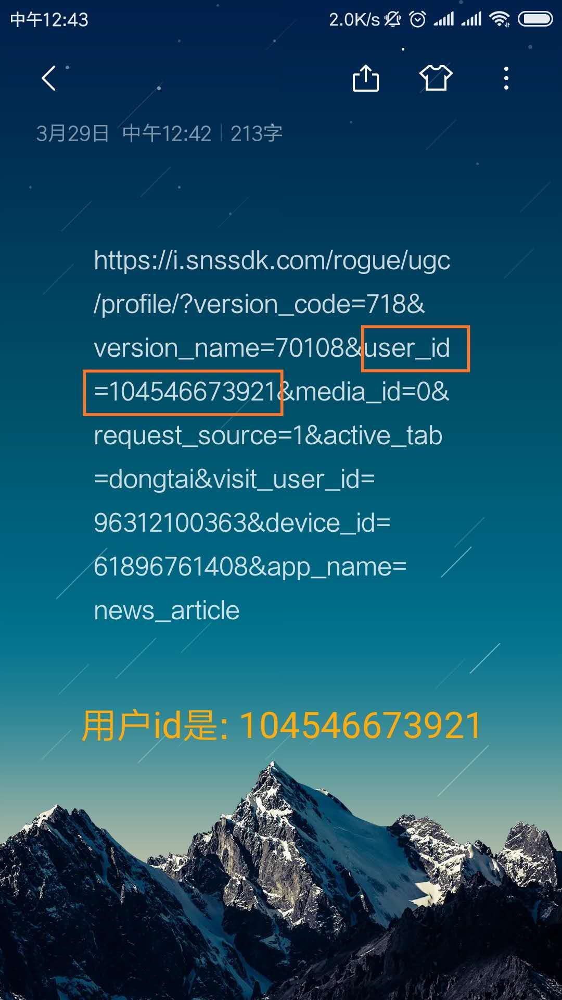

toutiao-video-crawler
===============

这是一个[Python](https://www.python.org)的脚本,配置运行后可以下载今日头条里的小视频.

## 怎么样方便地讨论交流

* 欢迎在[Github](https://github.com/jasonqiao36/crawler/issues)上开新的issue;

## 环境安装

配置好你的Python环境,然后

```bash
$ git clone git@github.com:jasonqiao36/crawler.git
$ cd crawler/toutiao_video
$ pip install -r requirements.txt
```

大功告成,直接跳到下一节配置和运行.


## 配置和运行

### 编辑sites.txt文件

找到一个文字编辑器,然后打开文件`sites.txt`,把你想要下载的今日头条用户的id编辑进去,以逗号/空格/tab/表格鍵/回车符分隔,可以多行,这个文件看起来是这样的:

```
104546673921
104546673922
```

然后保存文件,在终端运行`python crawler.py`


### 站点视频的下载

程序运行后,会默认在当前路径下面生成一个跟今日头条用户的id相同的文件夹,
视频都会放在这个文件夹下面.

运行这个脚本,不会重复下载已经下载过的视频,所以不用担心重复下载的问题.同时,多次运行可以
帮你找回丢失的或者删除的视频.

### 如何找到用户ID

<p align="center">
  
  
</p>


## 喜欢就打赏吧!

如果您喜欢这个项目, 那就打个赏支持一下作者吧! 非常感谢!
<p width="600" align="center">
    
</p>